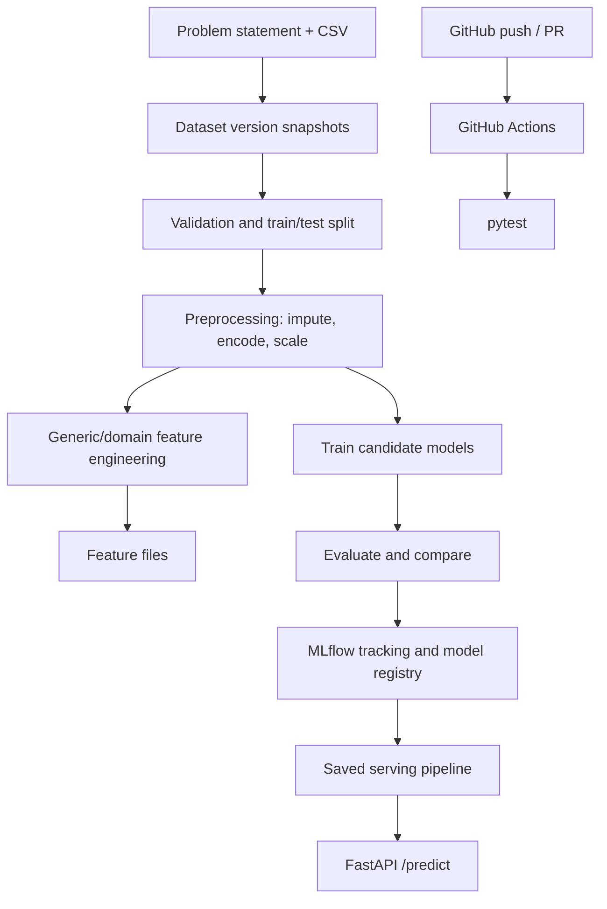

# Architecture

```mermaid
flowchart TD
 A[Problem statement + CSV] --> B[Dataset version snapshots]
 B --> C[Validation and train/test split]
 C --> D[Preprocessing: impute, encode, scale]
 D --> E[Generic/domain feature engineering]
 E --> F[Feature files]
 D --> G[Train candidate models]
 G --> H[Evaluate and compare]
 H --> I[MLflow tracking and model registry]
 I --> J[Saved serving pipeline]
 J --> K[FastAPI /predict]
 L[GitHub push / PR] --> M[GitHub Actions]
 M --> N[pytest]
```
